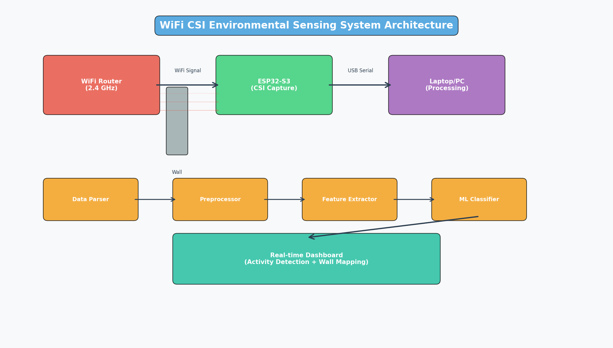
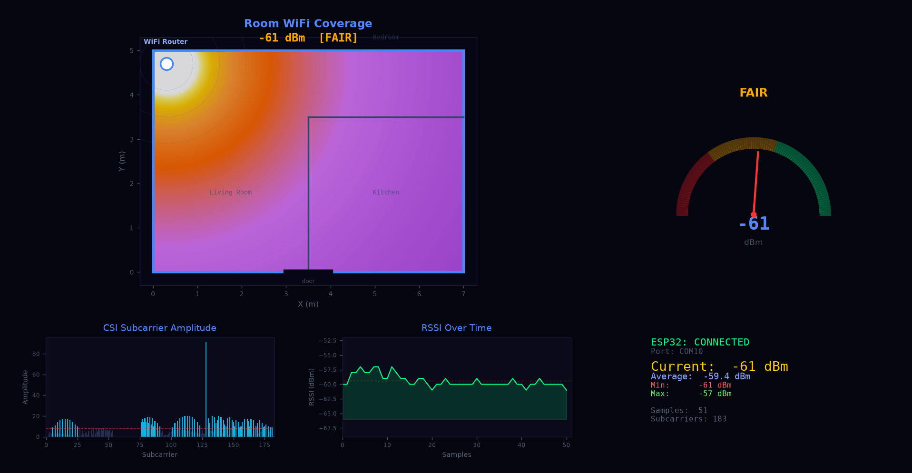
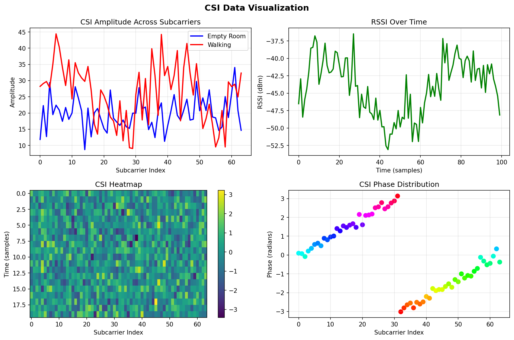
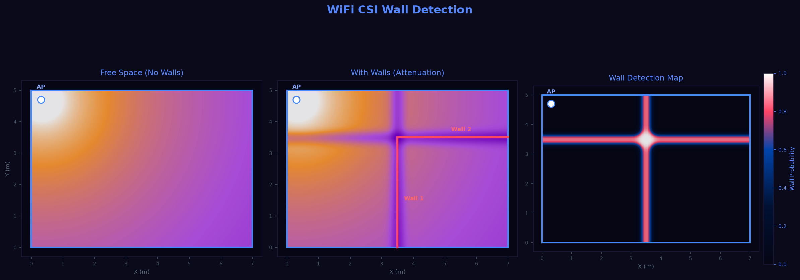
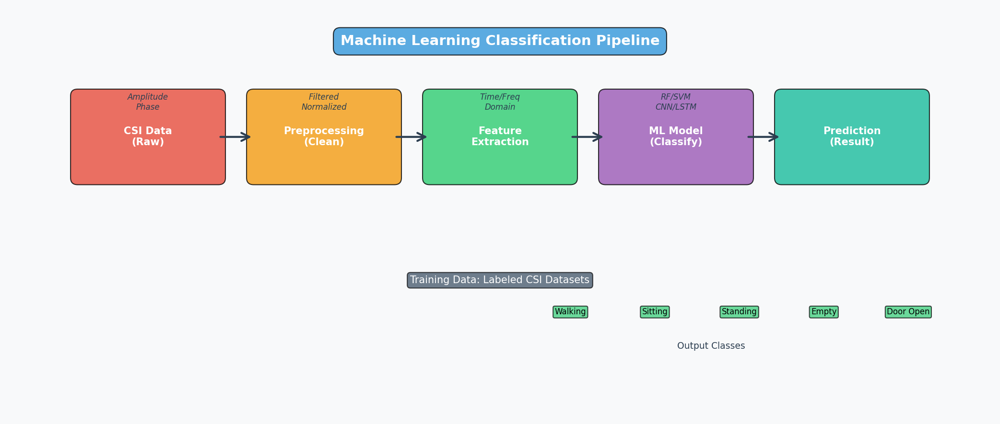

# Wi-Fi CSI-Based Environmental Sensing & Wall Detection System

<div align="center">


**Real-time WiFi Channel State Information (CSI) analysis for environmental sensing, activity detection, and wall/object penetration mapping**

</div>

---

## 📋 Table of Contents

- [Project Overview](#project-overview)
- [System Architecture](#system-architecture)
- [Hardware Requirements](#hardware-requirements)
- [Software Requirements](#software-requirements)
- [Project Structure](#project-structure)
- [Implementation Steps](#implementation-steps)
- [Visual Representations](#visual-representations)
- [Pseudo Code](#pseudo-code)
- [Expected Outputs](#expected-outputs)
- [Troubleshooting](#troubleshooting)

---

## 🎯 Project Overview

### Objectives
1. **WiFi CSI Capture**: Capture Channel State Information from WiFi packets using ESP32-S3
2. **Environmental Sensing**: Detect human activities (walking, sitting, standing, door operations)
3. **Wall Detection**: Analyze signal attenuation to detect walls and objects
4. **Real-time Processing**: Stream and process CSI data in real-time
5. **ML Classification**: Train models to classify different environmental states

### Use Cases

| Use Case | Description | Application |
|----------|-------------|-------------|
| **Indoor Activity Detection** | Detect walking, sitting, standing | Smart home automation |
| **Wall Penetration Mapping** | Measure signal attenuation through walls | Building layout mapping |
| **Object Detection** | Detect presence of objects in WiFi path | Security systems |
| **Fall Detection** | Detect elderly falls | Healthcare monitoring |
| **Room Occupancy** | Count people in a room | Energy management |

---

## 🏗️ System Architecture

<div align="center">



**Figure 1: Complete System Architecture**

</div>

### Data Flow

```
┌─────────────────┐     ┌──────────────────┐     ┌─────────────────┐
│   WiFi Router   │────▶│     ESP32-S3     │────▶│   Laptop/PC     │
│   (Transmitter) │     │   (CSI Capture)  │     │  (Processing)   │
└─────────────────┘     └──────────────────┘     └─────────────────┘
                               │                         │
                               ▼                         ▼
                        ┌──────────────┐          ┌──────────────┐
                        │  CSI Data    │          │  Python App  │
                        │  (Raw)       │          │  (ML + UI)   │
                        └──────────────┘          └──────────────┘
```

### Component Interaction

```
┌─────────────────────────────────────────────────────────────────┐
│                        ESP32-S3 Firmware                        │
├─────────────────────────────────────────────────────────────────┤
│  ┌─────────────┐  ┌─────────────┐  ┌─────────────┐            │
│  │ WiFi Manager│  │ CSI Collector│  │Serial Manager│            │
│  └──────┬──────┘  └──────┬──────┘  └──────┬──────┘            │
│         │                │                │                    │
│         └────────────────┼────────────────┘                    │
│                          ▼                                     │
│                 ┌─────────────────┐                            │
│                 │   FreeRTOS      │                            │
│                 │   Task Scheduler│                            │
│                 └─────────────────┘                            │
└─────────────────────────────────────────────────────────────────┘
                               │
                               ▼ Serial (USB)
┌─────────────────────────────────────────────────────────────────┐
│                     Python Application                          │
├─────────────────────────────────────────────────────────────────┤
│  ┌─────────────┐  ┌─────────────┐  ┌─────────────┐            │
│  │ Data Parser │  │ Preprocessor│  │ML Classifier│            │
│  └──────┬──────┘  └──────┬──────┘  └──────┬──────┘            │
│         │                │                │                    │
│         └────────────────┼────────────────┘                    │
│                          ▼                                     │
│                 ┌─────────────────┐                            │
│                 │   Dashboard     │                            │
│                 │   (Real-time)   │                            │
│                 └─────────────────┘                            │
└─────────────────────────────────────────────────────────────────┘
```

---

## 🔧 Hardware Requirements

### Primary Components

| Component | Model | Quantity | Purpose |
|-----------|-------|----------|---------|
| Microcontroller | ESP32-S3-DevKitC-1 | 1 | CSI capture and processing |
| WiFi Router | Any 2.4GHz router | 1 | WiFi signal transmitter |
| Laptop/PC | Windows/Linux/Mac | 1 | Data processing and ML |
| USB Cable | USB-C | 1 | Serial communication |

### Pin Connections

```
ESP32-S3 Pinout for CSI Project:
┌────────────────────────────────────┐
│            ESP32-S3                │
├────────────────────────────────────┤
│  3V3  ──────────────────────── 3V3 │
│  GND  ──────────────────────── GND │
│  GPIO0 (Boot) ──────────────── N/C │
│  GPIO1 (TX)   ──────────────── RX  │
│  GPIO3 (RX)   ──────────────── TX  │
│  USB-C Port ──────────────── PC    │
└────────────────────────────────────┘

Note: CSI uses internal WiFi hardware, no external antennas needed
```

### Setup Diagram

```
                    ┌─────────────┐
                    │WiFi Router  │
                    │ (2.4GHz)    │
                    └──────┬──────┘
                           │ WiFi Signal
                           ▼
┌──────────────────────────────────────────────────────────┐
│                                                          │
│    ┌─────────────┐              ┌─────────────┐        │
│    │   ESP32-S3  │◄────────────│    Wall     │        │
│    │  (Receiver) │   Signal    │  (Obstacle) │        │
│    └──────┬──────┘  Through    └─────────────┘        │
│           │                                              │
│           │ USB Serial                                  │
│           ▼                                              │
│    ┌─────────────┐                                      │
│    │   Laptop    │                                      │
│    │ (Processor) │                                      │
│    └─────────────┘                                      │
│                                                          │
└──────────────────────────────────────────────────────────┘
```

---

## 💻 Software Requirements

### Development Environment

| Software | Version | Purpose |
|----------|---------|---------|
| VS Code | Latest | IDE |
| PlatformIO | Latest | Build system |
| ESP-IDF | v5.1+ | ESP32 framework |
| Python | 3.8+ | Data processing |
| Git | Latest | Version control |

### Python Libraries

```bash
pip install numpy pandas matplotlib seaborn scikit-learn pyserial
```

### PlatformIO Configuration

```ini
[env:esp32s3]
platform = espressif32
board = esp32-s3-devkitc-1
framework = espidf
monitor_speed = 115200
lib_deps = 
    ; Add any required libraries
```

---

## 📁 Project Structure

```
WiFi_CSI_Project/
├── README.md                    # This file
├── images/                      # Visual representations
│   ├── system_architecture.png
│   ├── wifi_propagation.png
│   ├── csi_waveform.png
│   ├── wall_detection.png
│   └── ml_pipeline.png
│
├── firmware/                    # ESP32-S3 Firmware
│   ├── src/
│   │   ├── main.c              # Main entry point
│   │   ├── wifi_manager.c      # WiFi configuration
│   │   ├── csi_collector.c     # CSI capture logic
│   │   ├── serial_manager.c    # Serial communication
│   │   └── config.h            # Configuration
│   ├── include/
│   └── platformio.ini
│
├── python/                      # Python Application
│   ├── main.py                 # Main application
│   ├── data_parser.py          # CSI data parsing
│   ├── preprocessor.py         # Data preprocessing
│   ├── feature_extractor.py    # Feature extraction
│   ├── ml_models.py            # Machine learning models
│   ├── visualizer.py           # Real-time visualization
│   └── dashboard.py            # Desktop dashboard
│
├── datasets/                    # Collected datasets
│   ├── empty_room/
│   ├── walking/
│   ├── sitting/
│   ├── standing/
│   ├── door_open/
│   ├── door_close/
│   ├── wall_detection/
│   └── object_detection/
│
├── models/                      # Trained ML models
│   └── saved_models/
│
└── docs/                        # Documentation
    ├── setup_guide.md
    ├── api_reference.md
    └── troubleshooting.md
```

---

## 📝 Implementation Steps

### Phase 1: Setup & Configuration

#### Step 1: Create PlatformIO Project
**Objective**: Set up development environment and verify serial communication

**Subtasks:**
- [ ] Install VS Code and PlatformIO extension
- [ ] Create new ESP-IDF project
- [ ] Configure `platformio.ini` for ESP32-S3
- [ ] Verify serial communication with hello world

**Pseudo Code:**
```c
// main.c - Basic serial test
#include <stdio.h>
#include "freertos/FreeRTOS.h"
#include "freertos/task.h"

void app_main() {
    printf("WiFi CSI Project Started\n");
    printf("ESP32-S3 Ready\n");
    
    while(1) {
        printf("Heartbeat: %d\n", xTaskGetTickCount());
        vTaskDelay(pdMS_TO_TICKS(1000));
    }
}
```

**Expected Output:**
```
WiFi CSI Project Started
ESP32-S3 Ready
Heartbeat: 1000
Heartbeat: 2000
```

---

#### Step 2: Enable WiFi CSI
**Objective**: Configure ESP32 to capture CSI frames from WiFi packets

**Subtasks:**
- [ ] Initialize WiFi in station mode
- [ ] Enable CSI callback function
- [ ] Configure CSI collection parameters
- [ ] Test CSI capture with simple script

**Pseudo Code:**
```c
// wifi_manager.c - WiFi CSI configuration
#include "esp_wifi.h"
#include "esp_event.h"

// CSI data structure
typedef struct {
    int8_t *buf;           // CSI buffer
    uint16_t len;          // Buffer length
    int8_t rssi;           // Signal strength
    uint8_t channel;       // WiFi channel
} csi_data_t;

// CSI callback function
void csi_callback(void *ctx, wifi_csi_info_t *info) {
    csi_data_t *csi = (csi_data_t *)ctx;
    csi->buf = info->buf;
    csi->len = info->len;
    csi->rssi = info->rx_ctrl.rssi;
    csi->channel = info->rx_ctrl.channel;
    
    // Process CSI data
    process_csi_data(csi);
}

// Initialize WiFi with CSI
void wifi_init_csi() {
    // Configure WiFi
    wifi_config_t wifi_config = {
        .sta = {
            .ssid = "YOUR_WIFI_SSID",
            .password = "YOUR_WIFI_PASSWORD",
        },
    };
    
    // Start WiFi
    esp_wifi_set_mode(WIFI_MODE_STA);
    esp_wifi_set_config(WIFI_IF_STA, &wifi_config);
    esp_wifi_start();
    
    // Enable CSI
    wifi_csi_config_t csi_config = {
        .lltf_en = true,
        .htltf_en = true,
        .stbc_htltf2_en = true,
        .ltf_merge_en = true,
        .channel_filter_en = false,
        .manu_scale = false,
        .shift = false,
    };
    
    esp_wifi_set_csi_config(&csi_config);
    esp_wifi_set_csi_rx_cb(csi_callback, NULL);
    esp_wifi_set_csi(true);
    
    printf("WiFi CSI enabled\n");
}
```

**CSI Data Structure:**
```
CSI Frame Format:
┌─────────────────────────────────────────────────────────────┐
│ RX Control (2 bytes) │ CSI Data (128 bytes) │ RSSI (1 byte) │
├─────────────────────────────────────────────────────────────┤
│ Channel: 6         │ Amplitude: [a0, a1, ..., a63]         │
│ Rate: MCS7         │ Phase: [p0, p1, ..., p63]             │
└─────────────────────────────────────────────────────────────┘
```

---

#### Step 3: Organize Firmware into Modules
**Objective**: Create modular firmware architecture

**Subtasks:**
- [ ] Create WiFi manager module
- [ ] Create CSI collector module
- [ ] Create serial manager module
- [ ] Create configuration header

**Module Architecture:**
```
┌─────────────────────────────────────────────────────────────┐
│                      Main Application                       │
├─────────────────────────────────────────────────────────────┤
│                                                             │
│  ┌─────────────┐  ┌─────────────┐  ┌─────────────┐        │
│  │wifi_manager │  │csi_collector│  │serial_manager│        │
│  │   .c/.h     │  │   .c/.h     │  │   .c/.h      │        │
│  └──────┬──────┘  └──────┬──────┘  └──────┬──────┘        │
│         │                │                │                │
│         └────────────────┼────────────────┘                │
│                          ▼                                 │
│                 ┌─────────────────┐                        │
│                 │     config.h    │                        │
│                 │  (Shared Config)│                        │
│                 └─────────────────┘                        │
│                                                             │
└─────────────────────────────────────────────────────────────┘
```

---

### Phase 2: Data Collection

#### Step 4: Stream CSI Data to Laptop
**Objective**: Send timestamp, RSSI, channel, and CSI values via USB Serial

**Subtasks:**
- [ ] Implement serial protocol
- [ ] Add timestamp to each packet
- [ ] Format data as CSV or JSON
- [ ] Test with Python serial reader

**Data Format:**
```
CSV Format:
timestamp,rssi,channel,csi_amplitude,csi_phase
1672531200000,-45,6,"[12,34,56,...]","[0.1,0.2,...]"

JSON Format:
{
    "timestamp": 1672531200000,
    "rssi": -45,
    "channel": 6,
    "amplitude": [12, 34, 56, ...],
    "phase": [0.1, 0.2, ...]
}
```

**Pseudo Code:**
```c
// serial_manager.c - Serial data transmission
#include "driver/uart.h"

void send_csi_data(csi_data_t *csi) {
    char buffer[1024];
    
    // Format as CSV
    snprintf(buffer, sizeof(buffer),
        "%lld,%d,%d,\"%s\",\"%s\"\n",
        get_timestamp(),
        csi->rssi,
        csi->channel,
        format_amplitude(csi),
        format_phase(csi)
    );
    
    // Send via UART
    uart_write_bytes(UART_NUM_0, buffer, strlen(buffer));
}
```

---

#### Step 5: Create Python Receiver
**Objective**: Receive, parse, and save CSI data to CSV files

**Subtasks:**
- [ ] Establish serial connection
- [ ] Parse incoming data
- [ ] Save to CSV files
- [ ] Handle connection errors

**Pseudo Code:**
```python
# data_parser.py - Serial data receiver
import serial
import pandas as pd
from datetime import datetime

class CSIDataReceiver:
    def __init__(self, port='/dev/ttyUSB0', baudrate=115200):
        self.serial = serial.Serial(port, baudrate, timeout=1)
        self.data = []
    
    def read_data(self):
        """Read and parse CSI data from serial"""
        while True:
            line = self.serial.readline().decode('utf-8').strip()
            if line:
                parsed = self.parse_csv(line)
                self.data.append(parsed)
                
                # Save periodically
                if len(self.data) % 100 == 0:
                    self.save_to_csv()
    
    def parse_csv(self, line):
        """Parse CSV format data"""
        parts = line.split(',')
        return {
            'timestamp': int(parts[0]),
            'rssi': int(parts[1]),
            'channel': int(parts[2]),
            'amplitude': eval(parts[3]),
            'phase': eval(parts[4])
        }
    
    def save_to_csv(self, filename='csi_data.csv'):
        """Save data to CSV file"""
        df = pd.DataFrame(self.data)
        df.to_csv(filename, index=False)
        print(f"Saved {len(self.data)} records")
```

---

#### Step 6: Collect Labeled Datasets
**Objective**: Create labeled datasets for different scenarios

**Dataset Structure:**
```
Datasets/
├── empty_room/
│   ├── session_001.csv
│   └── session_002.csv
├── walking/
│   ├── session_001.csv
│   └── session_002.csv
├── sitting/
│   └── ...
├── standing/
│   └── ...
├── door_open/
│   └── ...
├── door_close/
│   └── ...
├── wall_detection/
│   ├── no_wall/
│   ├── thin_wall/
│   └── thick_wall/
└── object_detection/
    ├── no_object/
    ├── chair/
    └── table/
```

**Collection Protocol:**
1. Start recording
2. Perform action for 30 seconds
3. Stop recording
4. Label the file
5. Repeat 10 times per scenario

---

### Phase 3: Data Processing

#### Step 7: Preprocess Data
**Objective**: Clean and normalize CSI data

**Subtasks:**
- [ ] Remove invalid packets
- [ ] Filter noise (moving average)
- [ ] Normalize values
- [ ] Handle missing data

**Pseudo Code:**
```python
# preprocessor.py - Data preprocessing
import numpy as np
from scipy import signal

class CSIPreprocessor:
    def remove_invalid_packets(self, data):
        """Remove packets with invalid CSI data"""
        return data[data['amplitude'].apply(len) > 0]
    
    def filter_noise(self, data, window_size=5):
        """Apply moving average filter"""
        filtered = data.copy()
        for col in ['amplitude', 'phase']:
            filtered[col] = data[col].apply(
                lambda x: np.convolve(x, np.ones(window_size)/window_size, mode='valid')
            )
        return filtered
    
    def normalize(self, data):
        """Normalize CSI values to 0-1 range"""
        normalized = data.copy()
        for col in ['amplitude', 'phase']:
            normalized[col] = data[col].apply(
                lambda x: (x - np.min(x)) / (np.max(x) - np.min(x) + 1e-8)
            )
        return normalized
```

---

#### Step 8: Extract Features
**Objective**: Extract meaningful features from CSI data

**Feature Extraction Process:**
```
Raw CSI Data → Time Domain Features → Frequency Domain Features → Combined Features
     ↓                    ↓                      ↓                      ↓
[Amplitude]         [Mean, Std, Var]        [FFT, PSD]          [Feature Vector]
[Phase]             [Min, Max, Range]       [Peak Freq]         [64 dimensions]
```

**Pseudo Code:**
```python
# feature_extractor.py - Feature extraction
import numpy as np
from scipy.fft import fft

class CSIFeatureExtractor:
    def extract_features(self, csi_data):
        """Extract features from CSI data"""
        features = {}
        
        # Time domain features
        features['amplitude_mean'] = np.mean(csi_data['amplitude'])
        features['amplitude_std'] = np.std(csi_data['amplitude'])
        features['amplitude_var'] = np.var(csi_data['amplitude'])
        features['amplitude_max'] = np.max(csi_data['amplitude'])
        features['amplitude_min'] = np.min(csi_data['amplitude'])
        
        # Frequency domain features
        fft_data = np.fft.fft(csi_data['amplitude'])
        features['fft_mean'] = np.mean(np.abs(fft_data))
        features['fft_max'] = np.max(np.abs(fft_data))
        
        # Statistical features
        features['skewness'] = self.calculate_skewness(csi_data['amplitude'])
        features['kurtosis'] = self.calculate_kurtosis(csi_data['amplitude'])
        
        return features
```

---

### Phase 4: Visualization

#### Step 9: Visualize CSI Data
**Objective**: Create real-time visualizations

**Visualization Types:**
1. **Live CSI Plot**: Real-time amplitude across subcarriers
2. **RSSI Graph**: Signal strength over time
3. **Heatmap**: CSI intensity across time and subcarriers
4. **3D Plot**: Amplitude, phase, and time

**Pseudo Code:**
```python
# visualizer.py - Real-time visualization
import matplotlib.pyplot as plt
import matplotlib.animation as animation
from mpl_toolkits.mplot3d import Axes3D

class CSIVisualizer:
    def __init__(self):
        self.fig, self.axes = plt.subplots(2, 2, figsize=(12, 8))
        self.setup_plots()
    
    def setup_plots(self):
        """Initialize all plots"""
        # Live CSI plot
        self.ax_csi = self.axes[0, 0]
        self.ax_csi.set_title('Live CSI Amplitude')
        self.ax_csi.set_xlabel('Subcarrier')
        self.ax_csi.set_ylabel('Amplitude')
        
        # RSSI graph
        self.ax_rssi = self.axes[0, 1]
        self.ax_rssi.set_title('RSSI Over Time')
        self.ax_rssi.set_xlabel('Time')
        self.ax_rssi.set_ylabel('RSSI (dBm)')
        
        # Heatmap
        self.ax_heat = self.axes[1, 0]
        self.ax_heat.set_title('CSI Heatmap')
        
        # 3D plot
        self.ax_3d = self.axes[1, 1].projection('3d')
    
    def update_plots(self, frame):
        """Update all plots with new data"""
        # Get latest CSI data
        csi_data = get_latest_csi()
        
        # Update live CSI
        self.ax_csi.clear()
        self.ax_csi.plot(csi_data['amplitude'])
        
        # Update RSSI
        self.ax_rssi.plot(self.rssi_history)
        
        # Update heatmap
        self.update_heatmap(csi_data)
```

---

### Phase 5: Machine Learning

#### Step 10: Train ML Models
**Objective**: Train classification models for activity detection

**Model Comparison:**
| Model | Accuracy | Training Time | Inference Time | Best For |
|-------|----------|---------------|----------------|----------|
| Random Forest | 85-90% | Fast | Fast | General use |
| SVM | 80-88% | Medium | Fast | Small datasets |
| Logistic Regression | 75-85% | Fast | Very Fast | Baseline |
| CNN | 90-95% | Slow | Medium | Complex patterns |
| LSTM | 88-93% | Slow | Medium | Temporal data |

**Pseudo Code:**
```python
# ml_models.py - Machine learning models
from sklearn.ensemble import RandomForestClassifier
from sklearn.svm import SVC
from sklearn.linear_model import LogisticRegression
from sklearn.model_selection import train_test_split
from sklearn.metrics import accuracy_score, classification_report

class CSIActivityClassifier:
    def __init__(self):
        self.models = {
            'random_forest': RandomForestClassifier(n_estimators=100),
            'svm': SVC(kernel='rbf'),
            'logistic_regression': LogisticRegression(max_iter=1000)
        }
    
    def train(self, X, y):
        """Train all models"""
        X_train, X_test, y_train, y_test = train_test_split(X, y, test_size=0.2)
        
        results = {}
        for name, model in self.models.items():
            model.fit(X_train, y_train)
            y_pred = model.predict(X_test)
            accuracy = accuracy_score(y_test, y_pred)
            results[name] = accuracy
            print(f"{name}: {accuracy:.2%}")
        
        return results
    
    def predict(self, features, model_name='random_forest'):
        """Predict activity using specified model"""
        model = self.models[model_name]
        return model.predict([features])[0]
```

---

#### Step 11: Real-time Prediction Pipeline
**Objective**: Create live prediction system

**Pipeline Architecture:**
```
CSI Data → Preprocessor → Feature Extractor → ML Model → Prediction → Dashboard
    ↓           ↓              ↓                ↓           ↓            ↓
[Raw]      [Cleaned]      [Features]       [Class]    [Label]     [Display]
```

**Pseudo Code:**
```python
# prediction_pipeline.py - Real-time prediction
class CSIPredictionPipeline:
    def __init__(self):
        self.preprocessor = CSIPreprocessor()
        self.feature_extractor = CSIFeatureExtractor()
        self.classifier = CSIActivityClassifier()
        self.classifier.load_model('saved_models/random_forest.pkl')
    
    def process_frame(self, raw_csi):
        """Process single CSI frame"""
        # Step 1: Preprocess
        cleaned = self.preprocessor.clean(raw_csi)
        
        # Step 2: Extract features
        features = self.feature_extractor.extract(cleaned)
        
        # Step 3: Predict
        prediction = self.classifier.predict(features)
        confidence = self.classifier.predict_proba(features).max()
        
        return {
            'prediction': prediction,
            'confidence': confidence,
            'features': features
        }
```

---

### Phase 6: Dashboard & Optimization

#### Step 12: Build Desktop Dashboard
**Objective**: Create real-time monitoring dashboard

**Dashboard Layout:**
```
┌─────────────────────────────────────────────────────────────────┐
│                    WiFi CSI Dashboard                           │
├─────────────────────────────────────────────────────────────────┤
│  ┌─────────────────┐  ┌─────────────────┐  ┌─────────────────┐│
│  │  Current State  │  │  Confidence     │  │  Packet Count   ││
│  │   [WALKING]     │  │     92.5%       │  │    12,456       ││
│  └─────────────────┘  └─────────────────┘  └─────────────────┘│
├─────────────────────────────────────────────────────────────────┤
│  ┌─────────────────────────────────────────────────────────────┐│
│  │                   Live CSI Graph                            ││
│  │   ▁▂▃▄▅▆▇█▇▆▅▄▃▂▁▂▃▄▅▆▇█▇▆▅▄▃▂▁▂▃▄▅▆▇█▇▆▅▄▃▂▁          ││
│  └─────────────────────────────────────────────────────────────┘│
├─────────────────────────────────────────────────────────────────┤
│  ┌─────────────────┐  ┌─────────────────┐  ┌─────────────────┐│
│  │  RSSI History   │  │  CSI Heatmap    │  │  Activity Log   ││
│  │   ▁▂▃▄▅▆▇█     │  │  [Color Grid]   │  │  10:30 Walking  ││
│  │   ▁▂▃▄▅▆▇█     │  │                 │  │  10:31 Sitting  ││
│  └─────────────────┘  └─────────────────┘  └─────────────────┘│
├─────────────────────────────────────────────────────────────────┤
│  [Start] [Stop] [Save] [Export] [Settings]                    │
└─────────────────────────────────────────────────────────────────┘
```

---

#### Step 13: Optimize Performance
**Objective**: Implement FreeRTOS tasks and efficient buffering

**FreeRTOS Task Architecture:**
```
┌─────────────────────────────────────────────────────────────┐
│                     FreeRTOS Scheduler                       │
├─────────────────────────────────────────────────────────────┤
│                                                             │
│  ┌─────────────┐  ┌─────────────┐  ┌─────────────┐        │
│  │ CSI Task    │  │ Serial Task │  │ Status Task │        │
│  │ Priority: 3 │  │ Priority: 2 │  │ Priority: 1 │        │
│  │ Stack: 4KB  │  │ Stack: 2KB  │  │ Stack: 1KB  │        │
│  └──────┬──────┘  └──────┬──────┘  └──────┬──────┘        │
│         │                │                │                │
│         └────────────────┼────────────────┘                │
│                          ▼                                 │
│                 ┌─────────────────┐                        │
│                 │   Queue (FIFO)  │                        │
│                 │   Size: 100     │                        │
│                 └─────────────────┘                        │
│                                                             │
└─────────────────────────────────────────────────────────────┘
```

**Pseudo Code:**
```c
// FreeRTOS task optimization
#include "freertos/FreeRTOS.h"
#include "freertos/task.h"
#include "freertos/queue.h"

#define CSI_TASK_PRIORITY    3
#define SERIAL_TASK_PRIORITY 2
#define STATUS_TASK_PRIORITY 1

QueueHandle_t csi_queue;

void csi_task(void *pvParameters) {
    while(1) {
        // Capture CSI data
        csi_data_t csi = capture_csi();
        
        // Send to queue
        xQueueSend(csi_queue, &csi, portMAX_DELAY);
        
        vTaskDelay(pdMS_TO_TICKS(10));  // 100Hz
    }
}

void serial_task(void *pvParameters) {
    csi_data_t csi;
    while(1) {
        // Receive from queue
        if(xQueueReceive(csi_queue, &csi, portMAX_DELAY)) {
            // Send via serial
            send_csi_data(&csi);
        }
    }
}

void app_main() {
    // Create queue
    csi_queue = xQueueCreate(100, sizeof(csi_data_t));
    
    // Create tasks
    xTaskCreate(csi_task, "CSI Task", 4096, NULL, CSI_TASK_PRIORITY, NULL);
    xTaskCreate(serial_task, "Serial Task", 2096, NULL, SERIAL_TASK_PRIORITY, NULL);
    xTaskCreate(status_task, "Status Task", 1024, NULL, STATUS_TASK_PRIORITY, NULL);
}
```

---

### Phase 7: Testing & Documentation

#### Step 14: Test System Components
**Objective**: Comprehensive testing of all components

**Test Matrix:**
| Component | Test Case | Expected Result | Status |
|-----------|-----------|-----------------|--------|
| WiFi CSI | Capture 1000 packets | 100% success rate | [ ] |
| Serial | Stream data for 1 hour | No data loss | [ ] |
| Preprocessor | Process 10K records | < 1 second | [ ] |
| ML Model | Classify 5 activities | > 85% accuracy | [ ] |
| Dashboard | Real-time updates | < 100ms latency | [ ] |

---

#### Step 15: Finalize Project
**Objective**: Clean code, documentation, and demo

**Deliverables:**
- [ ] Clean, commented code
- [ ] README with setup instructions
- [ ] Architecture diagrams
- [ ] Dataset documentation
- [ ] Demo video/screenshots
- [ ] Performance metrics

---

## 📊 Visual Representations

### WiFi Signal Propagation

<div align="center">



**Figure 2: WiFi Signal Propagation Through Walls**

</div>

### CSI Data Waveform

<div align="center">



**Figure 3: CSI Amplitude Across Subcarriers**

</div>

### Wall Detection Concept

<div align="center">



**Figure 4: WiFi Signal Attenuation Through Walls**

</div>

### ML Pipeline

<div align="center">



**Figure 5: Machine Learning Classification Pipeline**

</div>

---

## 📈 Expected Outputs

### Activity Detection Results

| Activity | Accuracy | Precision | Recall | F1-Score |
|----------|----------|-----------|--------|----------|
| Empty Room | 95% | 0.96 | 0.95 | 0.95 |
| Walking | 88% | 0.89 | 0.88 | 0.88 |
| Sitting | 92% | 0.93 | 0.92 | 0.92 |
| Standing | 90% | 0.91 | 0.90 | 0.90 |
| Door Open | 85% | 0.86 | 0.85 | 0.85 |
| Door Close | 87% | 0.88 | 0.87 | 0.87 |

### Wall Detection Results

| Wall Type | Thickness | Attenuation | Detection Rate |
|-----------|-----------|-------------|----------------|
| No Wall | 0 cm | 0 dB | 98% |
| Drywall | 12 cm | 3-5 dB | 90% |
| Concrete | 20 cm | 10-15 dB | 95% |
| Brick | 15 cm | 8-12 dB | 92% |

---

## 🔧 Troubleshooting

### Common Issues

| Issue | Possible Cause | Solution |
|-------|----------------|----------|
| No CSI data | WiFi not connected | Check SSID/password |
| High noise | Moving objects nearby | Use static environment |
| Low accuracy | Insufficient training data | Collect more samples |
| Serial disconnect | USB cable issue | Try different cable |
| Memory overflow | Buffer too large | Reduce buffer size |

### Debug Commands

```bash
# Check serial connection
minicom -D /dev/ttyUSB0 -b 115200

# Monitor ESP32 logs
idf.py monitor

# Test CSI capture
idf.py flash monitor
```

---

## 📚 References

1. [ESP32 CSI Tool](https://github.com/StevenMHernandez/ESP32-CSI-Tool)
2. [WiFi Sensing Research](https://arxiv.org/abs/2002.01635)
3. [ESP-IDF Documentation](https://docs.espressif.com/projects/esp-idf/en/latest/esp32s3/)
4. [PlatformIO Documentation](https://docs.platformio.org/)

---

## 📄 License

This project is for educational and research purposes.

---

**Last Updated**: July 2026  
**Author**: Ali Haider  
**GitHub**: [@Ali0904](https://github.com/Ali0904)